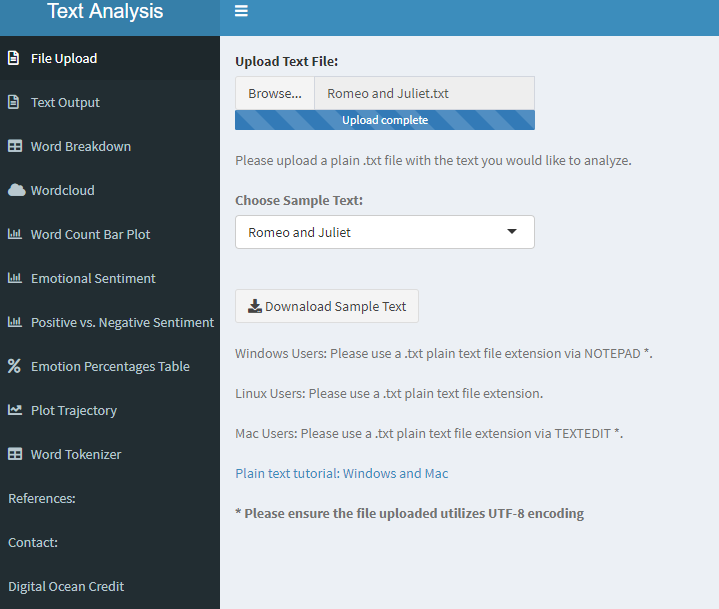
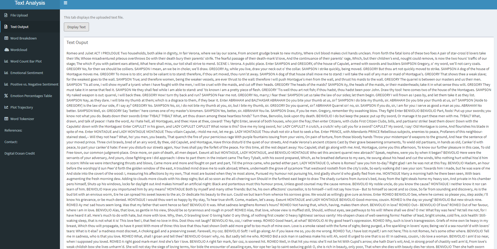
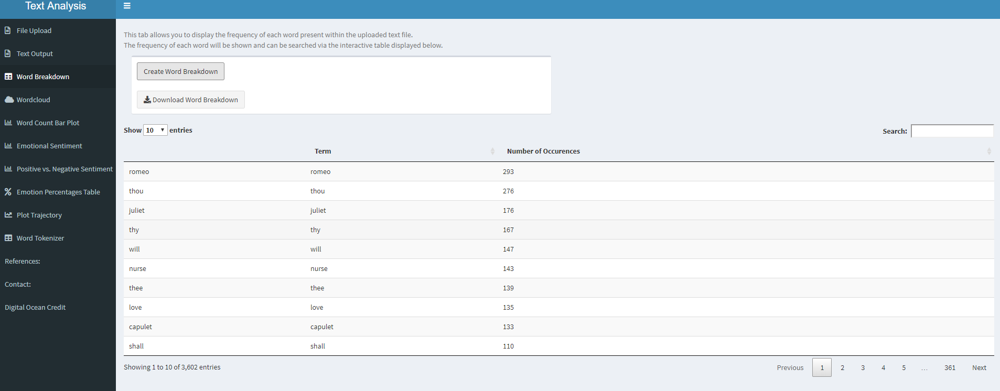
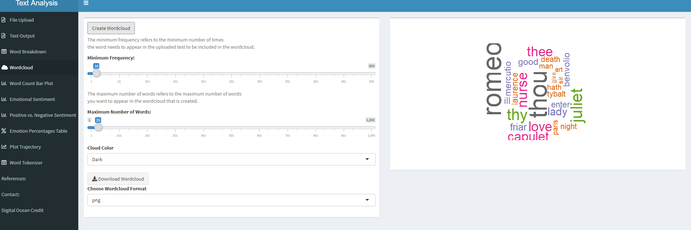
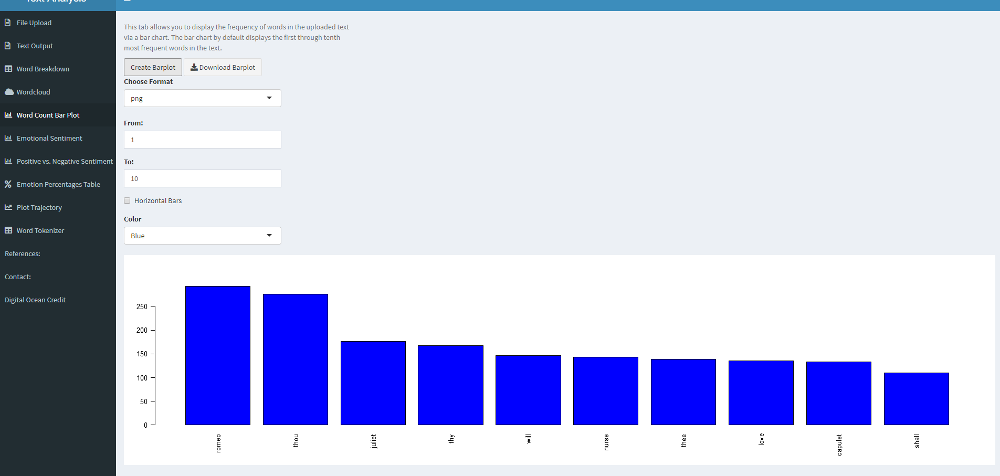
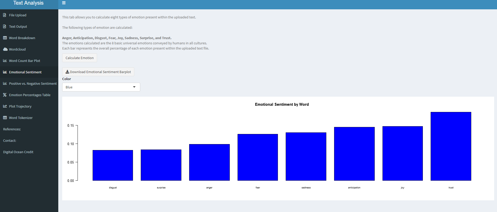
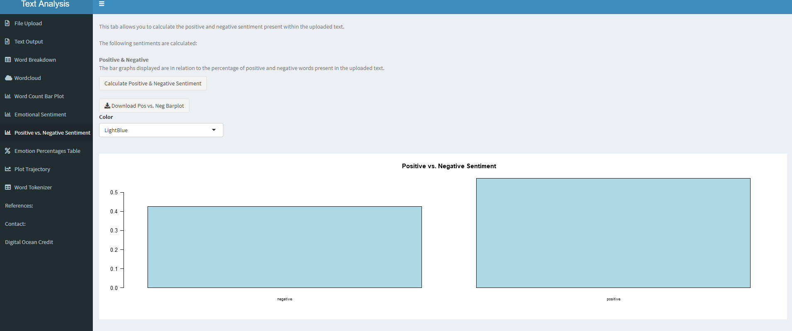
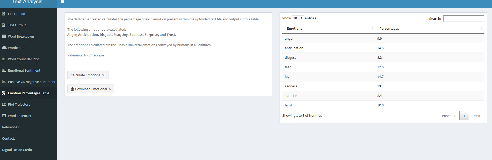
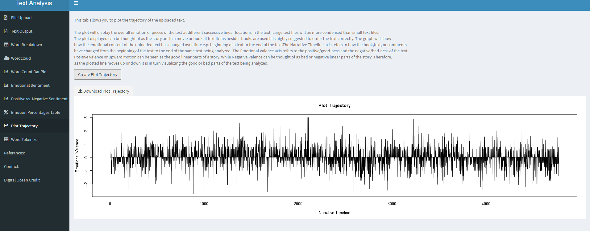
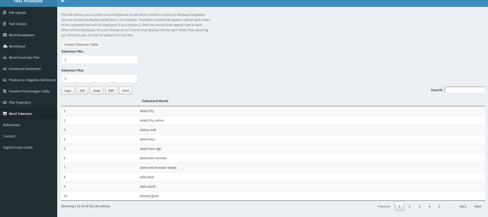

# Text-Analysis-App

+ This application allows a user to perform analysis on **text (words)**. This allows a user to quanitfy the emotion, positive, negative, emotional percentages, and emotional plot of a given text. 

Please cite myself and the other sources available on the Show Me Shiny site when utilizng this application. IF you have any questions feel free to contact me via my email address available in my Shiny App. 

Regards, Ben

**Note: The current max upload file size is currently unknown. Utilizing large corpuses of text will cause the application to crash**

### File Upload

---

### Text Output

---

### Word Breakdown

---

### Wordcloud

---

### Word Count Bar Plot

---

### Emotional Sentiment

---

### Positive vs. Negative sentiment

---

### Emotion Percentages Table

---

### Plot Trajectory: Emotional Valence of a Text

---

### Word Tokenizer

---